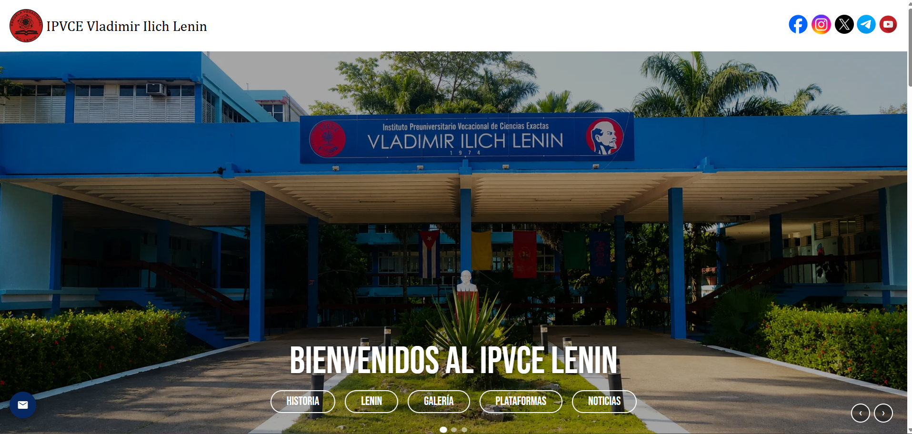
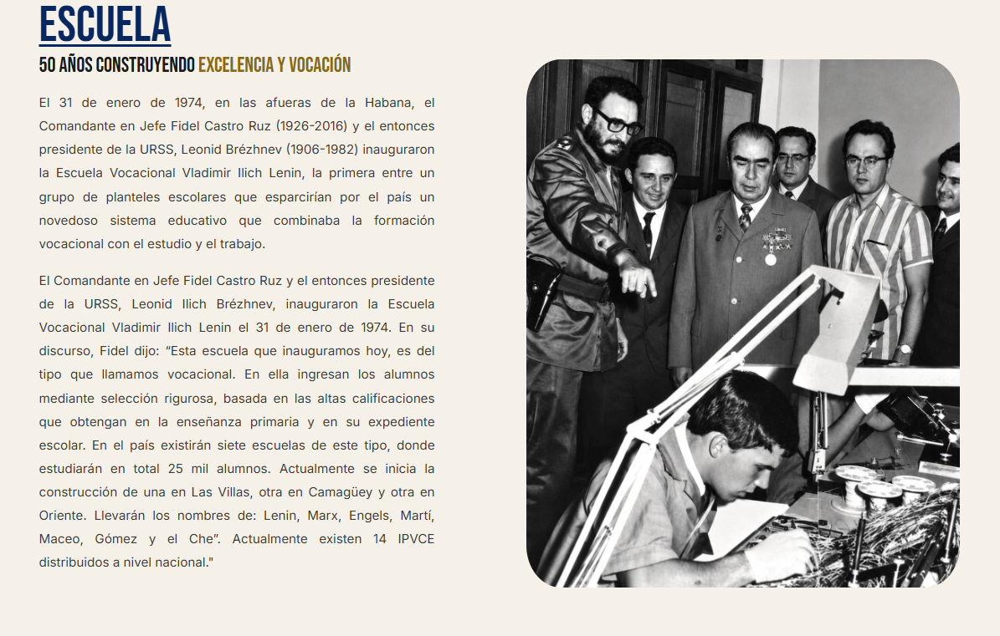
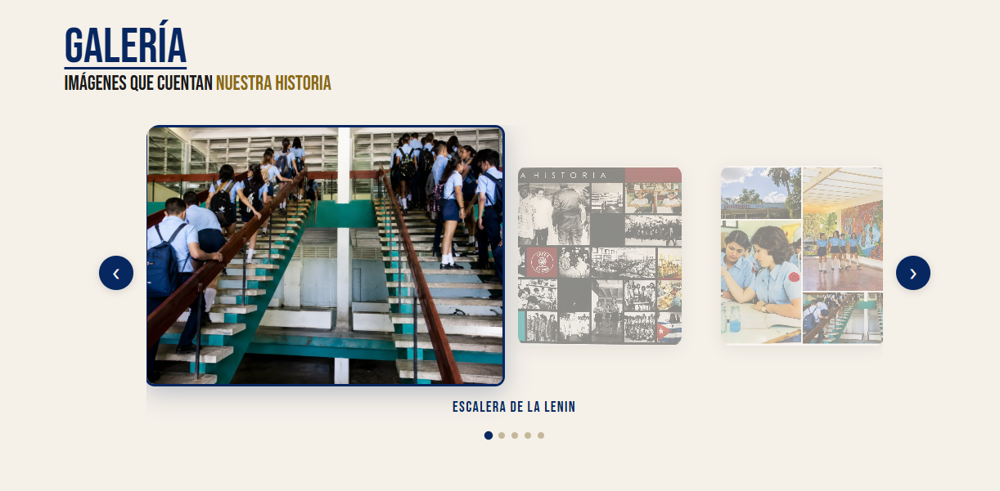

# 🏫 IPVCE Vladimir Ilich Lenin — Sitio Web Oficial

Sitio web institucional del **Instituto Preuniversitario Vocacional de Ciencias Exactas Vladimir Ilich Lenin**, desarrollado en Angular como proyecto académico.

> 🎯 **Objetivo:** Rediseñar y mejorar la página web institucional existente, originalmente construida en WordPress, logrando mayor rendimiento, control total del código, diseño completamente personalizado y una experiencia de usuario más moderna y fluida.

Este proyecto nació como una propuesta de modernización real para la institución. En lugar de depender de plantillas y plugins de WordPress, se construyó desde cero con Angular, lo que permitió un control total sobre el diseño, las animaciones, el rendimiento y la arquitectura de componentes. Cada sección fue diseñada con identidad visual propia — tipografía, paleta de colores y disposición — para reflejar la historia y el prestigio del instituto.

---

## 📸 Vista previa

| Hero | Historia | Galería |
|------|----------|---------|
|  |  |  |

---

## ✨ Características

- **Hero slider** con navegación y llamadas a la acción
- **Historia de la escuela** con texto e imágenes históricas
- **Sección Lenin** — biografía del fundador del nombre del instituto
- **Galería** con carrusel personalizado (efecto de profundidad, lightbox con zoom y puntos de navegación)
- **Plataformas educativas** — recursos y medios para la comunidad escolar
- **Noticias** — sección con tarjetas de artículos recientes
- **Formulario de contacto** reactivo con validación completa (Angular Reactive Forms)
- **Botón flotante de contacto** siempre visible en pantalla
- **Animaciones fade-in** activadas al hacer scroll con IntersectionObserver
- **Footer** con información de contacto, horario y redes sociales
- **Diseño responsive** — adaptado para móvil, tablet y escritorio

---

## 🛠️ Tecnologías

- [Angular 17+](https://angular.io/)
- [Angular Material](https://material.angular.io/) — componentes UI
- TypeScript
- SCSS / CSS personalizado
- Fuentes: [Inter](https://fonts.google.com/specimen/Inter) · [Bebas Neue](https://fonts.google.com/specimen/Bebas+Neue)

---

## 🚀 Cómo ejecutarlo localmente

### Requisitos previos

- Node.js 18+
- Angular CLI

```bash
npm install -g @angular/cli
```

### Instalación

```bash
# Clonar el repositorio
git clone https://github.com/alexandrolc-dev/IPVC-Lenin.git
cd ipvce-lenin

# Instalar dependencias
npm install

# Iniciar servidor de desarrollo
ng serve
```

Abre [http://localhost:4200](http://localhost:4200) en tu navegador.

### Compilar para producción

```bash
ng build
```

Los archivos de salida quedan en `/dist`.

---

## 📁 Estructura del proyecto

```
src/
└── app/
    ├── carrusel/          # Galería con carrusel 3D y lightbox
    ├── contacto-flotante/ # Botón y modal de contacto
    ├── footer/            # Pie de página
    ├── hero-slider/       # Slider principal
    ├── lenin/             # Sección biográfica
    ├── noticia/           # Tarjetas de noticias
    ├── plataformas/       # Recursos educativos
    └── school-history/    # Historia del instituto
```

---

## 👨‍💻 Autor

**Manuel Alexandro Legra Crespo**  
[GitHub](https://github.com/alexandrolc-dev) · [LinkedIn](https://www.linkedin.com/in/manuel-alexandro-legra-crespo-0769bb410/)

---

## 📄 Licencia

Este proyecto es de uso educativo y sin fines comerciales.
